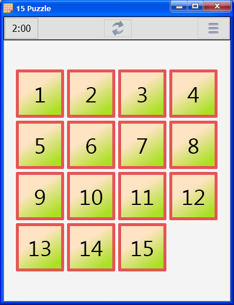

# 15Puzzle.Delphi
Простая игра в пятнашки. 

  Создана с целью изучить возможности кроссплатформенной библиотеки FireMonkey. 
В игре широко используются возможности анимации движения, изменения цвета, градиентов.
  
  Написана на Delphi 10.2. Собрать можно с помощью бесплатного Delphi Community Edition.
Собрана и проверена под Windows и под Android, так же FireMonkey позволяет собирать под MacOS и iOS. 

  Скриншот Windows-версии на Delphi:

  Скриншот Android-версии на Delphi:

# Порт на QT
  Довольно давно у меня возникло желание портировать эту игрушку на JavaScript, заодно попробовать базовую Web-разработку. Однако так как JS не похож на Delphi, у меня возникла идея портировать игру в два этапа – сначала на C++, а уже потом на JavaScript.
  
  Для C++ был выбран QT, с целью заодно попробовать QT и кроссплатформенную разработку на нём.
Этот проект выложен на GitHub под именем 15Puzzle.QT, вот он:  https://github.com/GeorgeBobrov/15Puzzle.Qt
  
  Так же там есть описание самого процесса портирования, и тех трудностей, которые в этом процессе возникли.

  Скриншот Android-версии на QT:

  
  
# Порт на JavaScript  
  Уже имея отлаженный C++ код, я принялся портировать его на JavaScript.
Этот проект выложен на GitHub под именем 15Puzzle.JS. 
  
Код:  https://github.com/GeorgeBobrov/15Puzzle.JS

  Игру можно поробовать прямо в браузере: http://georgebobrov.github.io/15Puzzle.JS/
  
# Порт на Java    
Имея опыт портирования на C++ и JavaScript, у меня возникла идея портировать это всё ещё и на Андроид в его нативном виде, на Java. Сказано - сделано.

Код вот:  https://github.com/GeorgeBobrov/15Puzzle.Java

# Порт на Kotlin
Начав портировать, нужно идти до конца. Так что вот ещё порт на Котлин:

https://github.com/GeorgeBobrov/15Puzzle.Kotlin

  Скриншот Android-версии на Kotlin:

  
